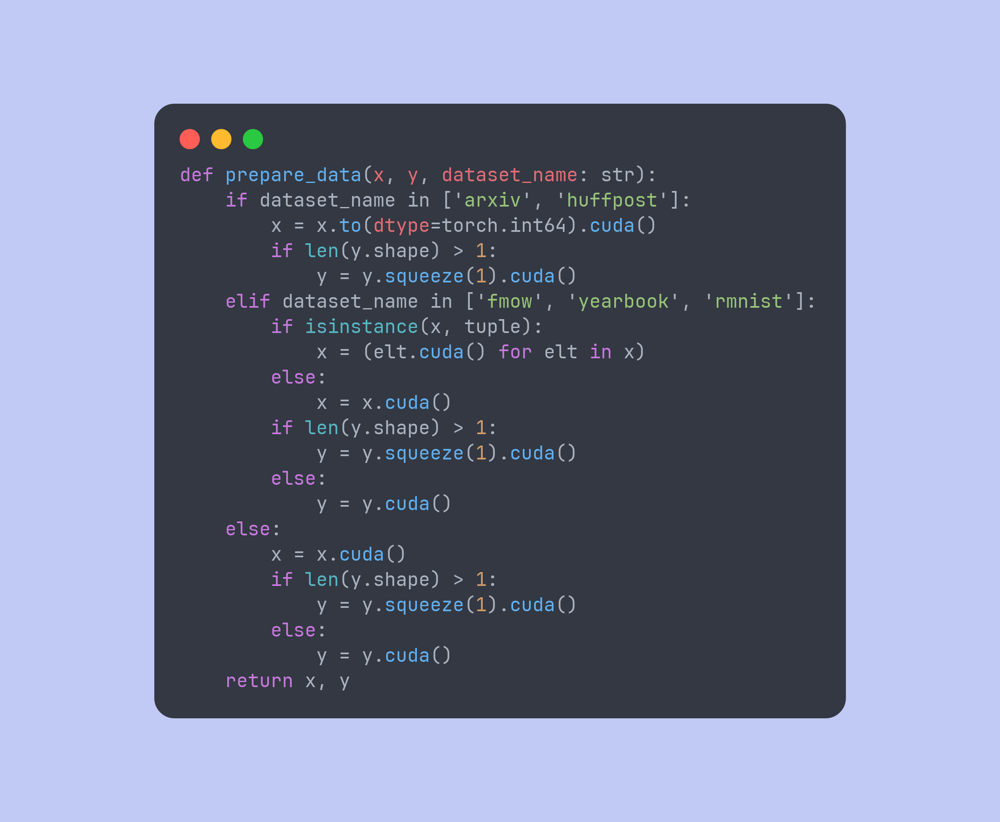

# LucidPlasma



## Installation

lazy.nvim:

```lua
{
  'ADJB1212/lucidplasma.nvim',
  lazy = false,
  priority = 1000,
  config = function()
    vim.cmd.colorscheme "lucidplasma"
  end
}
```

## Configuration

LucidPlasma supports extensive customization through its setup function:

```lua
{
  'ADJB1212/lucidplasma.nvim',
  lazy = false,
  priority = 1000,
  config = function()
    require('lucidplasma').setup({
      colors = {
        -- Override any colors
        background = '#1a1b26',
        foreground = '#c0caf5',
        -- ... any other color overrides
      },
      highlights = {
        -- Override any highlight groups
        Normal = { fg = '#ffffff' },
        -- ... any other highlight overrides
      },
      plugins = {
        -- Enable/disable specific plugin integrations
        telescope = true,
        nvim_tree = true,
        cmp = true,
        blink_cmp = true,
        notify = true,
        -- ... see full list below
      }
    })
    vim.cmd.colorscheme "lucidplasma"
  end
}
```

### Plugin Integrations

LucidPlasma includes built-in support for many popular plugins. You can enable or disable specific integrations:

- `blink_cmp` - blink.cmp completion
- `cmp` - nvim-cmp completion
- `dap` - nvim-dap debug adapter protocol
- `devicons` - nvim-web-devicons
- `fzf_lua` - fzf-lua fuzzy finder
- `indent_blankline` - indent-blankline.nvim
- `lazy` - lazy.nvim plugin manager
- `lir` - lir.nvim file manager
- `luasnip` - LuaSnip snippets
- `mason` - mason.nvim LSP installer
- `mini_indentscope` - mini.indentscope
- `neo_test` - neotest neovim unit tests
- `noice` - noice.nvim UI replacement
- `notify` - nvim-notify notifications
- `nvim_tree` - nvim-tree file explorer
- `rainbow_delimiters` - rainbow-delimiters.nvim
- `telescope` - telescope.nvim fuzzy finder
- `trouble` - trouble.nvim diagnostics

All plugins are enabled by default. To disable specific plugins:

```lua
require('lucidplasma').setup({
  plugins = {
    telescope = false,  -- Disable telescope integration
    cmp = false,        -- Disable nvim-cmp integration
  }
})
```

## Inspiration

This theme was heavily inspired by the following:

- [tokyonight.nvim](https://github.com/folke/tokyonight.nvim)
- [palenightfall.nvim](https://github.com/JoosepAlviste/palenightfall.nvim)
